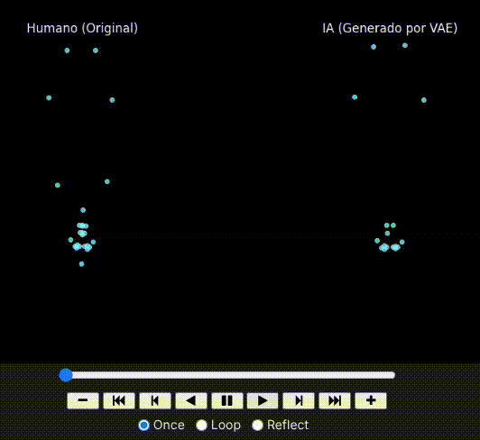

# 🤟 Sign Language Transformer VAE

This repository contains a complete Jupyter Notebook pipeline for training a **Transformer-based Variational Autoencoder (VAE)** on MediaPipe keypoint sequences. 

The primary goals of this project are to reconstruct sign language sequences, learn a distinct latent space for different sign classes, generate controlled synthetic data for dataset augmentation, and perform class-specific fine-tuning.


---

## 🧠 Architecture & Technical Specs

This model treats sign language keypoints as a time-series sequence, utilizing the self-attention mechanisms of Transformers alongside the generative capabilities of a VAE.

* **Input Dimension:** `252` features per frame (MediaPipe keypoint coordinates).
* **Sequence Handling:** Temporal interpolation to a fixed `SEQ_LEN` (e.g., 40 frames).
* **Latent Space (`LATENT_DIM`):** `64` dimensions.
* **Transformer Model Dim (`D_MODEL`):** `128`.
* **Encoder:** Linear Projection $\rightarrow$ Positional Encoding $\rightarrow$ Transformer Encoder $\rightarrow$ Temporal Pooling $\rightarrow$ Linear layers for `mu` and `logvar`.
* **Decoder:** Latent Projection $\rightarrow$ Temporal Repetition $\rightarrow$ Positional Encoding $\rightarrow$ Transformer Encoder (Sequential Generator) $\rightarrow$ Projection back to `252` coords.
* **Loss Function:** `MSE` (Reconstruction) + `KL Divergence` (Latent Regularization) utilizing **KL Annealing**.

---

## 🚀 Pipeline Workflow (`VAE.ipynb`)

The notebook guides you through the entire lifecycle of the model, from raw tensor processing to synthetic data generation.

### 1. Pre-training Phase
* **Dataset (`VAEDataset`):** Loads `.pt` files (e.g., from `PreFineTunningTensor`), interpolating sequences to match the target `SEQ_LEN`.
* **Training Loop:** Initializes the model and Adam optimizer. Uses Gradient Clipping (`max_norm=1.0`) and KL Annealing (prioritizing MSE initially, then ramping up KLD weight) to ensure a stable latent space. 
* **Output:** Saves the best weights to `best_vae_model.pt`.

### 2. Fine-Tuning Phase (`VAEFineTuneDataset`)
* Loads labeled data from `FineTunningTensor`.
* Continues training the pre-trained VAE with a lower learning rate (`1e-5`) to specialize in specific sign classes without catastrophic forgetting.
* **Output:** Saves the refined weights to `vae_transformer_finetuned_11_classes.pth`.

### 3. Synthetic Data Generation
The pipeline allows for controlled data augmentation by:
1.  Encoding real samples of a specific class into the latent space.
2.  Calculating the latent centroid for that class.
3.  Injecting controlled noise (`varianza_ruido`).
4.  Decoding these new latent vectors back into `[SEQ_LEN, 252]` sequences.

### 4. Visual Comparison Tool
Includes a built-in visualization function (`visualizar_comparacion_vae`) using `matplotlib` and `FuncAnimation`. It renders a side-by-side animated playback of the Human (Original) sequence versus the AI (VAE Generated) sequence.

---

## 📂 Expected Data Formats

The dataloaders expect PyTorch dictionaries saved as `.pt` files. Ensure your data matches these structures:

**1. Pre-training Input:**
```python
{
  'data': tensor[seq_len_variable, 252]
}
```

**2. Fine-tuning Input:**
```python
{
  'data': tensor[seq_len_variable, 252],
  'label': int
}
```

**3. Exported Synthetic Data:**
```python
{
  'data': tensor[SEQ_LEN, 252],
  'label': int,
  'varianza': float
}
```

---

## 🛠️ Quick Start Guide

1.  **Clone and Open:** Launch `VAE.ipynb` in your Jupyter environment.
2.  **Configure Paths:** Update the data directories at the top of the notebook:
    * `RUTA_PREENTRENAMIENTO`
    * `RUTA_TUS_DATOS`
3.  **Adjust Hyperparameters:** Verify `SEQ_LEN`, `LATENT_DIM`, `D_MODEL`, `batch_size`, and `epochs`.
4.  **Run Sequentially:** Execute the notebook cells in order:
    * Setup & Dataloaders $\rightarrow$ Model Init $\rightarrow$ Pre-training $\rightarrow$ Visualization $\rightarrow$ Fine-Tuning $\rightarrow$ Synthetic Generation.
5.  **Export:** Run the mass export cell to generate your augmented dataset (saved by default in `SyntheticVAETensor/`).

### Requirements
* Python 3.9+
* PyTorch
* NumPy
* Matplotlib
* Jupyter

```bash
pip install torch numpy matplotlib jupyter
```

---

## ⚠️ Important Notes

* **Sequence Consistency:** Ensure your global `SEQ_LEN` variable matches the target length mentioned in your dataset comments (e.g., 40 frames) to avoid tensor mismatch errors.
* **Noise Variance:** For stable synthetic generation, keep the noise variance (`varianza_ruido`) low to moderate (e.g., `0.1` to `0.3`). Too much noise will result in unrecognizable anatomical structures.
* **Quality Assurance:** Always validate the synthetic keypoints qualitatively (using the animation visualizer) and quantitatively before using them to train a downstream classification model.
